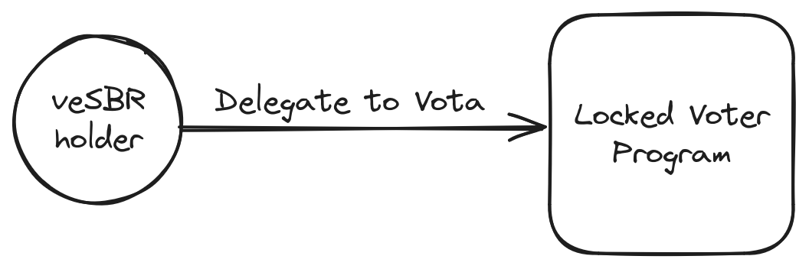

# Vota Protocol


A Solana-based protocol for trading votes for money.

## Installation

To run Vota, pull the repository from GitHub and install its dependencies. 
You will need [yarn](https://classic.yarnpkg.com/en/docs/install/) installed.

```bash
git clone https://github.com/metaDAOproject/vota-protocol
cd vota-protocol
yarn install --lock-file
```

## Testing

To run tests, first duplicate `.env.example` to `.env` and change `KEY_PATH` and `KEY_PATH2`
to valid paths to keypairs. Then run:

```bash
cargo run -p account-gen
anchor test 
```

The account-gen command is only needed when the keypair is changed.

## Repository Structure

This repo contains a few modules:
- `programs/vote-market`: the on-chain program
- `external-state/account-gen`: an executable for creating the accounts needed on the localhost
validator for testing
- `external-state/gauge-state`: a stub that allows the vote market program to
compose with the [Quarry gauge program](https://github.com/QuarryProtocol/gauge)
- `external-state/locked-voter-state`: a stub that allows the vote market program
to compose with the [Tribeca locked voter program](https://github.com/TribecaHQ/tribeca/tree/master/programs/locked-voter)
- `off-chain/vote-market-manager`: a CLI executable for operating the vote market,
including voting on behalf of users and sending rewards to users

## Flow

First, an admin must create a `VoteMarketConfig` account. This contains an `admin`, a 
`script_authority`, and a `gaugemeister`.


The script authority is the one who has the ability to vote on behalf of users. The admin
can change the script authority and other various parts of the program.

After a `VoteMarketConfig` has been created, vote buyers can create `VoteBuy`s. `VoteBuy`s are
specific to a gauge and epoch and contain an amount of tokens that constitute the vote payment.
Tokens need to be whitelisted by an admin before they can be used to buy votes.


Concurrently, veSBR holders can delegate their voting power to Vota via the locked voter program.



Then, the script authority can trigger Vota voting for a specific gauge. It can also claim rewards
on behalf of users.


# Operating the vote market


Near the end of the epoch, run the calculate inputs script to find out how much each
vote buyer has bought.
```bash 
./vmm calculate-inputs F72CPZ7vumQ6Z7e5ncWxkNunzcL79xkjTaiNCvZoL7Uc 101
```
The output file name will look something like this
`epoch_101_vote_info2024-03-01-02_32.json`

If the contents of the file look good, run the following command to calculate the weights.
```bash 
./vmm calculate-weights epoch_101_vote_info2024-03-01-02_32.json
```

The output file name will look something like this
`epoch_101_vote_weights2024-03-01-02_32.json`
Make sure the weights look reasonable for the amount each buyer paid.

Now execute the votes using these files as an input. For this step `path/to/keypair.json` should be the path to the keypair of the script authority.

```bash
./vmm execute-votes epoch_101_vote_info2024-03-01-02_32.js onepoch_101_vote_weights2024-03-01-02_32.json --keypair /path/to/keypair.json
```

Before claiming votes, you need to calculate the efficiency and make sure the program does not distribute more
rewards than the value of the SBR distributed divided by 1.2.

```bash
./vmm find-max-vote-buy epoch_101_vote_info2024-03-01-02_32.js onepoch_101_vote_weights2024-03-01-02_32.json --keypair /path/to/keypair.json
```

Now, once the voting epoch ends, the script authority can claim the rewards for all gauges for all users for the epoch.

```bash
./vmm execute-claim F72CPZ7vumQ6Z7e5ncWxkNunzcL79xkjTaiNCvZoL7Uc 101 --keypair /path/to/keypair.json
```